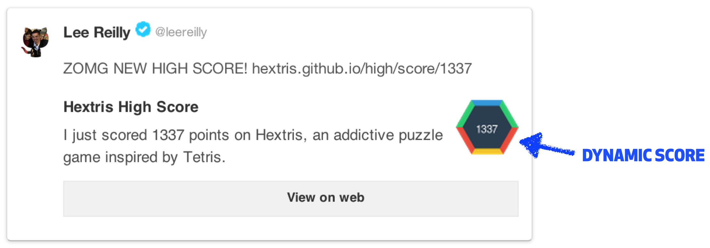

# Hextriscores

This little script generate a website for supporting dynamic Hextris score tiles in Tweets e.g.



It's janky as all hell, but it works™. It definitely needs a little experimentation...

#### [Test in Production](http://jerodsanto.net/drop/test-in-production.png)

1. Clone this repository to `github.com/hextris/hextriscores`.
2. Rename the repository from `hextriscores` to `high` (this gives us a nice URL like `hextris.github/high/score/1337`).
3. In the **Tweet your score feature** link to `hextris.github/high/score/$SCORE` instead of just `hextris.github/hextris`, where `$SCORE` is the players' actual score.

:boom: Doing so will make the high score appear in the Twitter Summary card images. Clicking on that URL will still redirect to the root URL @ `hextris.github.io/hextris`.


#### How Does it Work?

The file [`score/1337/index.html`](score/1337/index.html) would be available via `http://hextris.github.io/high/score/1337`. If you look at the `twitter:description` and `twitter:img:src` meta properties below, it should be obvious what's going on.

```html
<!DOCTYPE html>
<html lang='en'>
<head>
<title>Hextris High Score: 1337</title>
<meta property='twitter:card' content='summary' />
<meta property='twitter:site' content='@hextris' />
<meta property='twitter:site:id' content='2742209678' />
<meta property='twitter:creator' content='@hextris' />
<meta property='twitter:creator:id' content='2742209678' />
<meta property='twitter:domain' content='http://hextris.github.io' />
<meta property='twitter:title' content='Hextris High Score!' />
<meta property='twitter:description' content='I just scored 1337 points on Hextris, an addictive puzzle game inspired by Tetris.' />
<meta property='twitter:image:src' content='http://hextris.github.io/score/images/1337.png' />
<meta property='twitter:image:width' content='120' />
<meta property='twitter:image:height' content='120' />
<meta http-equiv='refresh' content='0;URL=http://hextris.github.io/hextris'>
</head>
</html>
```

#### Generating Images

```
$ git clone https://github.com/leereilly/hextriscores.git
$ bundle install
$ ruby script.rb
Processing image 1 ...
Processing image 2 ...
...
...
...
Processing image 9998 ...
Processing image 9999 ...
```


